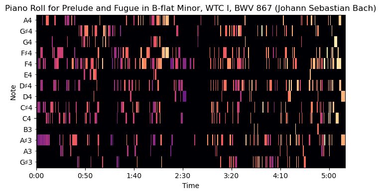

# score-based-generative-models
In this work, you will study a recent, related, yet different approach to be able to synthesize new datapoints. This process does not rely on a low dimensional subset of vectors, but is rather aimed at generating new points in a certain space using noise sampled from the same space.

Deep Learning Course (Project Page) : https://marcocuturi.net/dl.html

Blog post and GitHub about the Process : 

https://yang-song.github.io/blog/2021/score/

https://github.com/yang-song/score_sde_pytorch

We work on MAESTRO music data that comes from TensorFlow : https://magenta.tensorflow.org/datasets/maestro#v300

Example of piano roll for one random MIDI File : 

