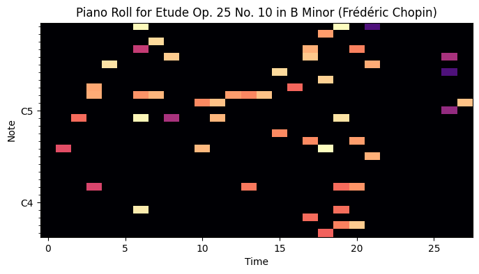

# *Creating Musical Artifacts* : Score-Based Generative Models for Music Generation

[](https://github.com/psf/black)

[](https://github.com/henriupton99/score-based-generative-models)


## Autor
Henri UPTON

# Overview

- [1. Usage](#1-Usage)
  - [1.1. Installation](#11-installation)
  - [1.2. Utilitaries / functions](#12-utilitaries-functions)
- [2. Problem Framing](#2-problem-framing)
- [3. MAESTRO Dataset](#3-maestro-dataset)
- [4. Running Scripts](#4-running-scripts)
- [5. Technical Results](#5-technical-results)
- [6. Ressources](#6-ressources)
  - [6.1. GitHubs](#61-githubs)
  - [6.2. Research Papers](#62-research-papers)


# 1. Usage

## 1.1. Installation

First, clone the repository :
```python
git clone https://github.com/henriupton99/score-based-generative-models.git
```

Then, create a virtual environment dedicated to this repository :
```python
conda create -n score-based-generative-models
conda activate score-based-generative-models
```

Then, install the requirements : 

```python
pip install -r requirements.txt
```

## 1.2. Utilitaries / Functions

The script [config.py](config.py) is about setting all hyperparameters for future data loading and training :
```python
from config import config
```

The script [utils.py](utils.py) provide two classes for pre-processing of MAESTRO Dataset and post-processing of samples generated by Score Based Generative Model :
```python
# pre-processing of MAESTRO data samples :
from utils import process_maestro_data
from process_maestro_data import unzip_data, read_csv_data, read_midi_file, get_midi_metadata, plot_piano_roll

# post-processing of generated samples :
from utils import process_generated_samples
from process_generated_samples import piano_roll_to_midi, plot_piano_roll
```

The script [data_builder.py](data_builder.py) is about creating a Pytorch Dataset instance for specific MAESTRO Dataset (c.f 3. MAESTRO Dataset for informations about the Dataset) :
```python
from data_builder import MaestroDataset
```
The scripts [model.py](model.py), [sampler.py](sampler.py), [sde.py](sde.py) come from hands on Notebook of the Score Based Generative Model structure from Yang Song and al. (https://colab.research.google.com/drive/120kYYBOVa1i0TD85RjlEkFjaWDxSFUx3?usp=sharing). It provides structure for the model (U-net), sampling (Euler-Maruyama), and Stochastic Differential Equation Dynamic (SDE) :

```python
from model import ScoreNet, loss_fn
from sampler import Euler_Maruyama_sampler, pc_sampler, ode_sampler
from sde import marginal_prob_std, diffusion_coeff
```

# 2. Problem Framing

Score-Based Generative Modeling (SBGM) is a new approach to generative modeling that uses the score function to estimate the gradient of the log-likelihood function. The log-likelihood function is used to measure how well a model can generate a given set of data. SBGM can provide advantages regarding other generative modeling approaches, such as Generative Adversarial Networks (GANs) and Variational Autoencoders (VAEs). Among them, the ability to generate high-quality samples and the ability to estimate the density of the data is crutial.

Based on SBGM framework and an algorithm for training such models, we explore the possibilities of music generation based on the MAESTRO (MIDI and Audio Edited for Synchronous TRacks and Organization) database.

# 3. MAESTRO Dataset

The MAESTRO (MIDI and Audio Edited for Synchronous TRacks and Organization) dataset is a large-scale dataset of piano performances that was created by the Music Technology Group at Universitat Pompeu Fabra in Barcelona, Spain. It was designed to support research on multi-modal music performance analysis and generation.

The dataset contains over 200 hours of aligned MIDI and audio recordings of classical piano performances, which were obtained from publicly available sources such as YouTube and the International Piano-e-Competition. The performances were selected to cover a wide range of styles, composers, and pianists, and were manually aligned to ensure accurate synchronization between the MIDI and audio data.

This Dataset comes from TensorFlow website : https://magenta.tensorflow.org/datasets/maestro#v300

## 3.1. Piano Roll Matrix

A music can be perceived as a set of played notes which are characterized for each of them by a start date and an end date (we omit the velocity for this work). Thus, it is possible to extract from a piece (and its metadata in .midi format) its piano roll matrix: by splitting the duration of the piece into regular time intervals (according to a frequency $f_s$), each music can be represented by a sparse matrix S of shape $(duration\_track \times f_s , num\_pitches)$ defined as follows : for all $j \in (1, \dots, num\_pitches)$, $S_{t,j} = 1$ if note of pitch $j$ is played in time interval $[t, t+1]$, and $0$ otherwise. Here is an example of piano roll matrix :



# 4. Running Scripts

In order to run main scripts, please install all required packages in you virtual environment and run the three scripts in the following order : 

| Script Name | Output |
|--------------|------------|
| <span style="color: red;"> *training_main.py*</span> | <span style="color: red;">**loads the data from the MEASTRO dataset as a Pytorch dataset, launches the model (defined in model.py script) training phase and saves the model in the ./data folder (ckpt.pth)**</span>|
| <span style="color: orange;">*sampling_main.py*</span> | <span style="color: orange;">**loads the previously trained model with the training_main.py script, and generates musical samples with one of the samplers defined in sampler.py. The musical samples in midi format (.mid) generated are available in the folder ./data/samples_midi**</span> |
| <span style="color: green;">*piano_roll_main.py*</span> | <span style="color: green;">**loads the samples previously generated by the sampling_main.py script and generates their piano roll matrix (c.f 3. MAESTRO Dataset). The constructed images are available in the folder ./figures/piano_roll_generated/**</span> |


# 5. Technical Results

Here is a piano roll matrix for a sample generated from Euler Maruyama sampler :


You can find below Soundcloud links (.mp3) for generated samples from the three available sampling methods :

| Sampler Type                | Link                         |
|-----------------------------|------------------------------|
| Prediction-Correction Sampler | https://on.soundcloud.com/m6Zau |
| ODE Sampler                  | https://on.soundcloud.com/UrBWF |
| Euler Maruyama Sampler       | https://on.soundcloud.com/4ZQyd |


# 6. Ressources

## 6.1. GitHubs / Links

[Deep Learning Course ENSAE 2023 (Project Page)](https://marcocuturi.net/dl.html)

[GitHub from Yang Song about SBGM (Pytorch Version)](https://github.com/yang-song/score_sde_pytorch) 

[Blog post about the Score Based Generative Model](https://yang-song.github.io/blog/2021/score/)

## 6.2. Research Papers

@article{gan,
  author={Creswell, Antonia and White, Tom and Dumoulin, Vincent and Arulkumaran, Kai and Sengupta, Biswa and Bharath, Anil A.},
  journal={IEEE Signal Processing Magazine}, 
  title={Generative Adversarial Networks: An Overview},
  url={https://arxiv.org/abs/1710.07035}
  year={2018}}

@article{vae,
  author={Estiri, Amir Hossein and Sabramooz, Mohammad Reza and Banaei, Ali and Dehghan, Amir Hossein and Jamialahmadi, Benyamin and Siavoshani, Mahdi Jafari},
  booktitle={2020 10th International Symposium onTelecommunications (IST)}, 
  title={A Variational Auto-Encoder Approach for Image Transmission in Noisy Channel}, 
  url={https://arxiv.org/abs/2010.03967}
  year={2020}}

@article{sbgm,
  title={Score-Based Generative Modeling through Stochastic Differential Equations.},
  year={2020},
  author = {Yang Song, Jascha Sohl-Dickstein, Diederik P Kingma, Abhishek Kumar, Stefano Ermon, Ben Poole},
  url={https://openreview.net/forum?id=PxTIG12RRHS}
}

@article{energy-based-model,
  author={Yilun Du, Igor Mordatch},
  journal={arXiv:1903.08689}, 
  title={Implicit Generation and Generalization in Energy-Based Models}, 
  year={2018},
  url={https://arxiv.org/abs/1903.08689}
  }

@article{blog-post,
  title={Score-Based Generative Modeling through Stochastic Differential Equations (Blog Post).},
  year={2019},
  author = {Yang Song},
  url={https://yang-song.net/blog/2021/score/}
}

@article{langevin-dynamic,
  title={Generative Modeling by Estimating Gradients of the Data Distribution.},
  year={2019},
  author = {Yang Song, Stefano Ermon},
  url={https://arxiv.org/abs/1907.05600}
}

@article{u-net,
  title={U-Net: Convolutional Networks for Biomedical Image Segmentation.},
  year={2015},
  author = {Olaf Ronneberger, Philipp Fischer, Thomas Brox},
  url={https://arxiv.org/abs/1505.04597}
}

@article{jukebox,
  title={Jukebox: A Generative Model for Music.},
  year={2020},
  author = {Prafulla Dhariwal, Heewoo Jun, Christine Payne, Jong Wook Kim, Alec Radford, Ilya Sutskever},
  url={https://arxiv.org/abs/2005.00341}
}

@article{maestro-dataset,
  title={MAESTRO Dataset v3 from TensorFlow Magenta.},
  year={2022},
  author = {TensorFlow},
  url={https://magenta.tensorflow.org/datasets/maestro}
}

@article{
  maestro-article,
  title={Enabling Factorized Piano Music Modeling and Generation with the {MAESTRO} Dataset},
  author={Curtis Hawthorne and Andriy Stasyuk and Adam Roberts and Ian Simon and Cheng-Zhi Anna Huang and Sander Dieleman and Erich Elsen and Jesse Engel and Douglas Eck},
  booktitle={International Conference on Learning Representations},
  year={2019},
  url={https://openreview.net/forum?id=r1lYRjC9F7},
}

@article{euler-maruyama,
  title={Inferring parameters of SDEs using a Euler-Maruyama scheme},
  year={2018},
  author = {PyMC3},
  url={https://www.pymc.io/projects/docs/en/v3/pymc-examples/examples/time_series/Euler-Maruyama_and_SDEs.html}
}

@article{predictor-corrector,
  title={Predictor-Corrector Methods},
  year={1998},
  author = {MIT PC Sampler},
  url={https://web.mit.edu/10.001/Web/Course_Notes/Differential_Equations_Notes/node7.html}
}

@article{ode-scipy,
  title={Scipy Module integrate.ode Documentation},
  year={2023},
  author = {Scipy Intergrate ODE},
  url={https://docs.scipy.org/doc/scipy/reference/generated/scipy.integrate.ode.html}
}

